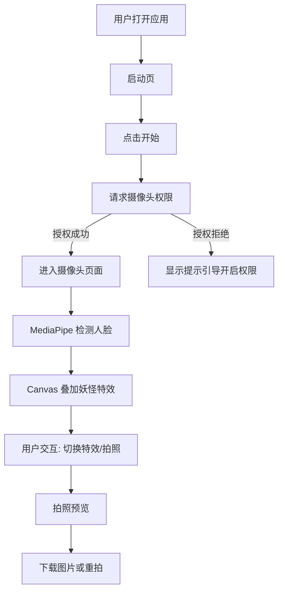

# 照妖镜 (Demon-Revealing Mirror) - 产品需求文档

## 1. 产品概述

照妖镜是一款基于浏览器的人脸检测趣味 Web 应用。用户通过摄像头实时检测人脸，系统在人脸上叠加"妖怪"特效（如红色眼睛发光、獠牙、角等），营造出"照妖镜"的趣味效果。项目兼容 PC 和移动端，纯前端实现，无需后端服务。

## 2. 核心功能

### 2.1 功能模块

1. **首页/启动页**：展示应用标题"照妖镜"，提供开始按钮，引导用户授权摄像头
2. **摄像头实时检测页**：
   - 调用设备摄像头获取实时视频流
   - 使用 MediaPipe Face Detection 实时检测人脸位置
   - 在人脸区域叠加妖怪特效（Canvas 绘制）
   - 支持切换不同特效模式
3. **拍照/截图功能**：用户可以截取当前画面保存为图片
4. **特效切换面板**：提供多种妖怪特效供用户选择

### 2.2 页面详情

| 页面名称 | 模块名称 | 功能描述 |
|---------|---------|---------|
| 启动页 | Hero 区域 | 展示照妖镜标题、古风背景、开始按钮 |
| 主页面 | 摄像头区域 | 全屏/自适应视频流，人脸检测框，特效叠加 |
| 主页面 | 控制面板 | 特效切换、拍照按钮、前后摄像头切换（移动端） |
| 结果页 | 截图预览 | 展示拍摄的图片，提供下载和重新拍摄 |

## 3. 核心流程

用户打开应用 → 看到启动页 → 点击开始 → 请求摄像头权限 → 进入摄像头页面 → MediaPipe 实时检测人脸 → Canvas 叠加妖怪特效 → 用户可切换特效/拍照 → 拍照后预览并下载

## 4. 用户界面设计

### 4.1 设计风格

- **主题风格**：东方玄幻/古风 + 科技感的融合，神秘暗色调
- **主色调**：深紫黑 `#1a0b2e` 作为背景，暗红 `#c41e3a` 作为强调色，金色 `#d4af37` 作为点缀
- **按钮样式**：古风边框 + 发光效果，圆角但带有一些尖锐元素
- **字体**：标题使用有书法感或古风的字体（如系统自带的 serif 或 Google Fonts 中的中文字体），正文使用清晰的无衬线字体
- **布局**：移动端全屏沉浸式，PC 端居中卡片式
- **图标风格**：线条风格，带有一些神秘/玄幻元素

### 4.2 页面设计概述

| 页面名称 | 模块名称 | UI 元素 |
|---------|---------|---------|
| 启动页 | Hero 区域 | 深色渐变背景，金色发光标题"照妖镜"，古风装饰边框，红色发光开始按钮，底部说明文字 |
| 主页面 | 摄像头区域 | 全屏视频流，人脸检测框（红色发光边框），Canvas 特效层叠加 |
| 主页面 | 控制面板 | 底部悬浮面板：特效选择按钮（横向滚动）、中央大圆形拍照按钮、右上角切换摄像头按钮 |
| 结果页 | 截图预览 | 居中展示图片，底部下载和重拍按钮，暗色遮罩背景 |

### 4.3 响应式设计

- **Desktop-first**：PC 端最大宽度限制，居中展示，摄像头区域保持 16:9 比例
- **移动端适配**：全屏展示，控制面板在底部，按钮尺寸适配触摸操作
- **横屏/竖屏**：支持 Orientation 变化，自动调整布局

### 4.4 动画与特效

- 启动页标题：金色文字发光脉冲动画
- 按钮悬停：边框发光增强，轻微放大
- 人脸检测框：红色呼吸灯效果边框
- 特效切换：淡入淡出过渡
- 拍照：闪光灯效果 + 快门动画
