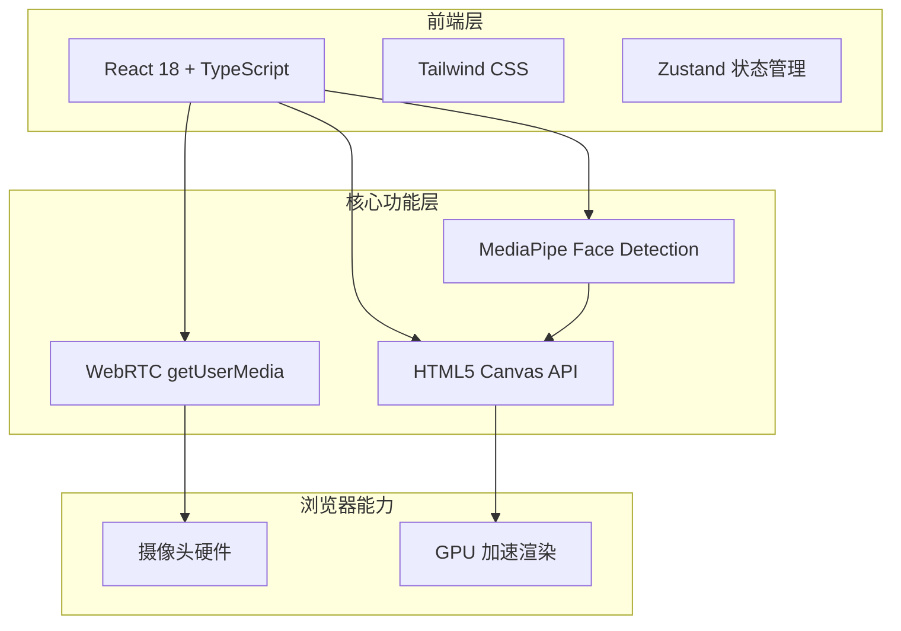

# 照妖镜 (Demon-Revealing Mirror) - 技术架构文档

## 1. 架构设计



## 2. 技术描述

- **前端框架**: React@18 + TypeScript
- **构建工具**: Vite
- **样式方案**: Tailwind CSS@3
- **状态管理**: Zustand
- **人脸检测**: @mediapipe/face_detection (Google MediaPipe，纯前端运行)
- **摄像头访问**: 浏览器原生 WebRTC getUserMedia API
- **特效绘制**: HTML5 Canvas 2D API
- **图标库**: lucide-react

## 3. 路由定义

| 路由 | 用途 |
|-----|------|
| / | 启动页 |
| /mirror | 摄像头实时检测主页面 |
| /result | 拍照结果预览页 |

## 4. 组件结构

```
src/
├── components/
│   ├── StartPage.tsx          # 启动页
│   ├── MirrorPage.tsx         # 主页面（摄像头+特效）
│   ├── ResultPage.tsx         # 结果预览页
│   ├── CameraView.tsx         # 摄像头视频组件
│   ├── FaceEffectCanvas.tsx   # 人脸特效 Canvas 组件
│   ├── EffectSelector.tsx     # 特效选择器
│   ├── CaptureButton.tsx      # 拍照按钮
│   └── PermissionPrompt.tsx   # 权限请求提示
├── hooks/
│   ├── useCamera.ts           # 摄像头管理 Hook
│   ├── useFaceDetection.ts    # 人脸检测 Hook
│   └── useCanvasEffects.ts    # Canvas 特效绘制 Hook
├── store/
│   └── useMirrorStore.ts      # Zustand 全局状态
├── types/
│   └── index.ts               # TypeScript 类型定义
├── utils/
│   └── effects.ts             # 特效绘制工具函数
├── App.tsx
└── main.tsx
```

## 5. 状态管理 (Zustand)

```typescript
interface MirrorState {
  // 摄像头状态
  cameraActive: boolean;
  facingMode: 'user' | 'environment';
  
  // 人脸检测状态
  faceDetected: boolean;
  faceBoundingBox: { x: number; y: number; width: number; height: number } | null;
  
  // 特效状态
  currentEffect: 'demon-eyes' | 'fangs' | 'horns' | 'full-demon' | 'ghost';
  
  // 截图状态
  capturedImage: string | null;  // base64 data URL
  
  // Actions
  setCameraActive: (active: boolean) => void;
  toggleFacingMode: () => void;
  setFaceDetected: (detected: boolean, box?: MirrorState['faceBoundingBox']) => void;
  setCurrentEffect: (effect: MirrorState['currentEffect']) => void;
  setCapturedImage: (image: string | null) => void;
}
```

## 6. 人脸检测与特效绘制流程

1. **初始化 MediaPipe**：加载 face_detection 模型（WASM 后端）
2. **获取视频流**：通过 getUserMedia 获取摄像头视频流
3. **实时检测**：每帧将视频帧传递给 MediaPipe 进行检测
4. **获取人脸位置**：得到人脸边界框 (bounding box) 和关键点
5. **Canvas 绘制特效**：
   - 清空 Canvas
   - 根据人脸位置和大小计算特效绘制区域
   - 绘制选中的妖怪特效（红眼发光、獠牙、角等）
6. **拍照**：将 Canvas 内容导出为 base64 图片

## 7. 特效设计方案

| 特效名称 | 描述 | 绘制方式 |
|---------|------|---------|
| demon-eyes | 红色发光眼睛 | 在眼部位置绘制红色径向渐变圆 |
| fangs | 獠牙 | 在嘴部下方绘制白色尖牙形状 |
| horns | 恶魔角 | 在额头两侧绘制弯曲的角 |
| full-demon | 全套恶魔特效 | 组合 eyes + fangs + horns |
| ghost | 幽灵效果 | 半透明绿色遮罩 + 模糊边缘 |

## 8. 性能优化

- MediaPipe 模型使用 WASM 后端，在 Web Worker 中运行避免阻塞主线程
- Canvas 绘制使用 requestAnimationFrame 确保流畅
- 人脸检测结果节流，避免过于频繁的特效重绘
- 移动端降低视频分辨率以提升性能
